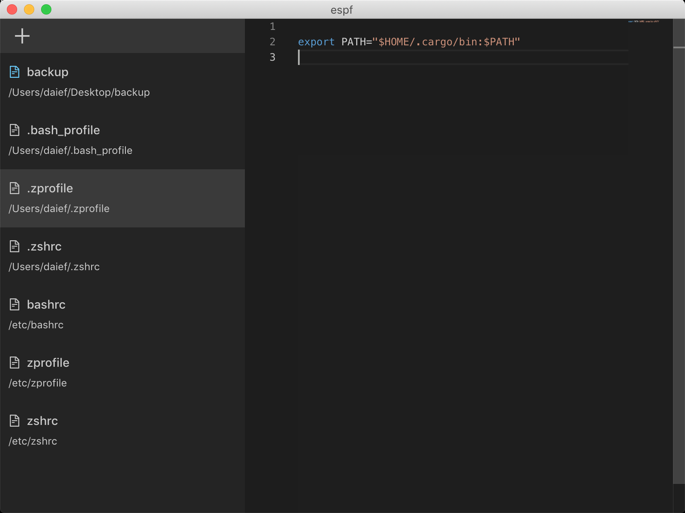

## espf

Maybe `edit startup file`?

[Electron](https://electronjs.org/) Demo 应用，自动读取系统启动文件，提供编辑界面，使用快捷键保存，保存后自动追加 `source` 命令。

**只在本机（macOS）上调试过。**



## dev

启动主进程和渲染进程：

```bash
# bash 1
$ git clone git@github.com:daief/espf.git && cd espf

# yarn is necessary
$ yarn install

# start main process
$ yarn dev
```

```bash
# bash 2
# start renderer process
yarn dev:ui
```

## build & pack

```bash
# build main & ui files
$ yarn build

# after build, pack dist files to mac app
$ yarn pack:mac
```
